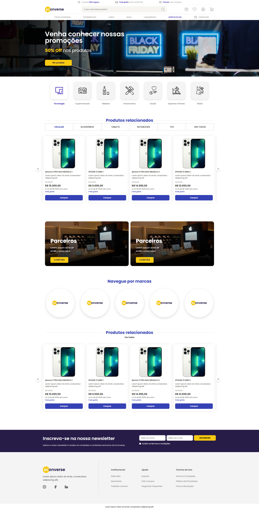

<h1 align="center">
  Ecoverse (Teste Front End)
</h1>

Projeto desenvolvido como parte do teste técnico para a vaga de Front-End Júnior na Econverse.


<p align="center">
  
</p>

## 🛠️ Tecnologias utilizadas

- React
- TypeScript
- Vite
- Sass (SCSS Modules)
- ESLint + Prettier

## ⚙️ Funcionalidades

- Página Home conforme layout do Figma
- Vitrine de produtos em formato de slider
- Modal de produto ao clicar no botão "Comprar"

<br>

# 🛠️ Instalação

### Requisitos

- Node.js (versão 14 ou superior)
- npm (versão 6 ou superior)

### Passos

1. **Clone o repositório:**

```sh
git clone https://github.com/RodrigoRodrigues-Dev/teste-front-end.git

cd teste-front-end
```

2. **Instale as dependências:**

```sh
npm install
```
<br>

# 🚀 Uso
Para iniciar a aplicação em modo de desenvolvimento, execute:

```sh
npm run dev
```
Para construir o projeto para produção, utilize:

```sh
npm run build
```

Rodar o ESLint:

```sh
npm run lint
```
Rodar o Prettier (formatar):

```sh
npm run format
```
Estrutura de pastas:
```sh
src/
  components/
    common/
    layout/
    sections/
  assets/
    images/
    icons/
  styles/
```

## Observações
Os produtos são consumidos a partir de um mock local baseado no JSON fornecido no teste.
O modal é aberto ao clicar no botão de compra do produto.

### Autor

Rodrigo Rodrigues
<br>
